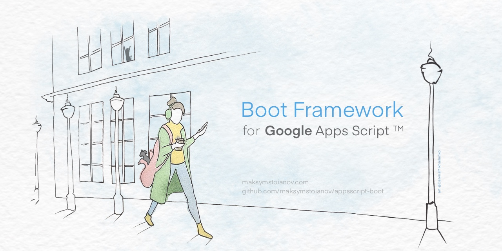

<a name="top"></a>



<p align="right">
  <i>Artist: <a href="https://darynamikhailenko.com/?utm_source=github&utm_medium=readme&utm_campaign=appsscript-boot&utm_content=banner_artist_credit" title="Portfolio of Daryna Mikhailenko, the artist">Daryna Mikhailenko</a></i>
</p>

# Boot Framework for Google Apps Script™ projects

[](https://github.com/google/clasp)
[](LICENSE)
[](https://github.com/MaksymStoianov/appsscript-boot/releases)

[](https://github.com/MaksymStoianov/appsscript-boot/stargazers)
[](https://github.com/MaksymStoianov/appsscript-boot/forks)
[](https://github.com/sponsors/MaksymStoianov)

## Introduction

`appsscript-boot` is a powerful, scalable, and modern framework for building high-performance Google Apps Script
applications.

## How to Install

To get started, install the dependencies:

```bash
npm install github:MaksymStoianov/appsscript-boot#main
```

> **Note:** It's recommended to use tags (`#vX.Y.Z`) for production environments to ensure version stability.

For example:

```bash
npm install github:MaksymStoianov/appsscript-boot#v1.1.0
```

## How to Use

### 1. Creating a Controller

Define a REST controller that will handle HTTP requests to your Apps Script web application:

```TypeScript
import {Get, RestController} from "appsscript-boot";

@RestController("api/sheet")
export class Sheet {
    @Get("active-range")
    getActiveRange(): string {
        return "This action return active range.";
    }
}
```

This code is a great example of using the `appsscript-boot` framework to build a **web app on Google Apps Script** with
a **REST API** architecture. Essentially, it turns your standard Apps Script code into a full-fledged web application
that can handle and respond to HTTP requests (GET and POST).

<details><summary>More ...</summary>

#### Why is this needed?

Google Apps Script has simple `doGet` and `doPost` functions for handling web requests, but they're quite basic. To
build a
more complex application with multiple API endpoints, you'd have to write a lot of manual routing logic. This can
quickly become clunky and difficult to manage.

`appsscript-boot` solves this problem by providing decorators (`@RestController`, `@Get`) and automated routing. This
allows
you to structure your code in a way that is common in modern web frameworks like Express.js or NestJS.

The result is code that is more organized, readable, and scalable.

```TypeScript
import {App, Newable, Get, RestController} from "appsscript-boot";

/**
 * This JSDoc comment describes the `doGet` function.
 * It's the standard handler for GET requests in Google Apps Script.
 *
 * @param   event The GET request event object, containing request information.
 * @returns The result of the request processing, usually HTML content or JSON.
 */
// The `doGet` function is a mandatory entry point for web app GET requests.
export function doGet(event: GoogleAppsScript.Events.DoGet) {
    // Defines an array of controllers that the application will use.
    // In this case, only the `Sheet` class is used.
    const controllers: Newable[] = [Sheet];

    // Defines an array of providers (services) that will be available for injection.
    // There are no providers in this example.
    const providers: Newable[] = [];

    // Creates an application instance, passing it the list of controllers and providers.
    const app = App.create({
        controllers,
        providers
    });

    // Delegates the processing of the GET request to the created application instance.
    return app.doGet(event);
}

/**
 * This JSDoc comment describes the `doPost` function.
 * It's the standard handler for POST requests in Google Apps Script.
 *
 * @param event The POST request event object.
 * @returns The result of the request processing.
 */
// The `doPost` function is the entry point for web app POST requests.
export function doPost(event: GoogleAppsScript.Events.DoPost) {
    // Defines controllers for POST requests (same logic as for `doGet`).
    const controllers: Newable[] = [Sheet];

    // Defines providers (none here).
    const providers: Newable[] = [];

    // Creates an application instance.
    const app = App.create({
        controllers,
        providers
    });

    // Delegates the processing of the POST request to the application.
    return app.doPost(event);
}

/**
 * This JSDoc comment describes the `Sheet` class.
 * It acts as a REST controller for handling API requests.
 */
// The `@RestController` decorator declares this class as a controller and sets the base path to "api/sheet".
@RestController("api/sheet")
export class Sheet {
    /**
     * This JSDoc comment describes the `getActiveRange` method.
     * It is a handler for a GET request.
     */
    // The `@Get` decorator marks this method as a GET request handler and sets the endpoint path to "active-range".
    // The full path to this endpoint will be "api/sheet/active-range".
    @Get("active-range")
    // The method signature: it takes no arguments and returns a string.
    getActiveRange(): string {
        // The return value of the method.
        return "This action return active range.";
    }
}
```

#### How does it work?

The process is built on two key parts:

1. Entry Points (`doGet` and `doPost`): These are the only functions that Google Apps Script calls when it receives a
   web
   request. Instead of processing requests directly, they act as a "gateway." They initialize the application (
   `App.create`)
   with its controllers and then delegate all further processing to the framework's core handler.

2. Controllers (`@RestController`): The Sheet class is your controller. The `@RestController("api/sheet")` decorator
   tells
   the
   framework that this class will handle all requests starting with the `/api/sheet` path. The methods within this
   class (
   `getActiveRange`) become your endpoints. The `@Get("active-range")` decorator specifies that the method should handle
   GET
   requests to the `/api/sheet/active-range` path.

So, when a GET request comes in for `https://script.google.com/macros/s/.../exec?path=/api/sheet/active-range`, Apps
Script
calls `doGet`, which then passes the request to the framework. The framework parses the URL, finds the matching
controller (`Sheet`) and method (`getActiveRange`), executes it, and returns the result as an HTTP response.

This approach completely separates your request handling logic from the low-level details of Apps Script, making your
code **clean**, **modular**, and **maintainable**.

</details>

## Decorators

### Class decorators

<details open><summary>Class decorators</summary>

| Decorator             | Description                                                   |
|-----------------------|---------------------------------------------------------------|
| `@Controller()`       | Marks a class as a general-purpose controller.                |
| `@Service()`          | Marks a class as a service, typically holding business logic. |
| `@Repository()`       | Marks a class as a repository, abstracting data access logic. |
| `@Injectable()`       | Marks a class as available for dependency injection.          |
| `@HttpController()`   | Marks a class as an HTTP request controller.                  |
| `@RestController()`   | Alias for `@HttpController()`.                                |
| `@DocController()`    | Marks a class as a Google Docs event controller.              |
| `@DocsController()`   | Alias for `@DocController()`.                                 |
| `@FormController()`   | Marks a class as a Google Forms event controller.             |
| `@FormsController()`  | Alias for `@FormController()`.                                |
| `@SheetController()`  | Marks a class as a Google Sheets event controller.            |
| `@SheetsController()` | Alias for `@SheetController()`.                               |
| `@SlideController()`  | Marks a class as a Google Slides event controller.            |
| `@SlidesController()` | Alias for `@SlideController()`.                               |

</details>

### Method decorators

<details open><summary>Method decorators</summary>

| Decorator            | Description                                                                                                                                                  |
|----------------------|--------------------------------------------------------------------------------------------------------------------------------------------------------------|
| `@Install()`         | Handles [`onInstall`](https://developers.google.com/apps-script/guides/triggers#oninstalle) event, triggered when the add-on is first installed.             |
| `@Open()`            | Handles [`onOpen`](https://developers.google.com/apps-script/guides/triggers#onopene) event, triggered when a Google Sheet is opened.                        |
| `@Edit()`            | Handles [`onEdit`](https://developers.google.com/apps-script/guides/triggers#onedite) event, triggered by manual cell changes in a Google Sheet.             |
| `@Change()`          | Handles `onChange` event, triggered by any structural or content change in a Google Sheet.                                                                   |
| `@SelectionChange()` | Handles [`onSelectionChange`](https://developers.google.com/apps-script/guides/triggers#onselectionchangee) event, triggered by user cell selection changes. |
| `@FormSubmit()`      | Handles `onFormSubmit` event, triggered when a form connected to a Google Sheet is submitted.                                                                |
| `@Post()`            | Maps a method to handle HTTP POST requests.                                                                                                                  |
| `@Get()`             | Maps a method to handle HTTP GET requests.                                                                                                                   |
| `@Delete()`          | Maps a method to handle HTTP DELETE requests.                                                                                                                |
| `@Put()`             | Maps a method to handle HTTP PUT requests.                                                                                                                   |
| `@Patch()`           | Maps a method to handle HTTP PATCH requests.                                                                                                                 |
| `@Options()`         | Maps a method to handle HTTP OPTIONS requests.                                                                                                               |
| `@Head()`            | Maps a method to handle HTTP HEAD requests.                                                                                                                  |
| `@PostMapping()`     | Alias for `@Post()`.                                                                                                                                         |
| `@GetMapping()`      | Alias for `@Get()`.                                                                                                                                          |
| `@DeleteMapping()`   | Alias for `@Delete()`.                                                                                                                                       |
| `@PutMapping()`      | Alias for `@Put()`.                                                                                                                                          |
| `@PatchMapping()`    | Alias for `@Patch()`.                                                                                                                                        |
| `@OptionsMapping()`  | Alias for `@Options()`.                                                                                                                                      |
| `@HeadMapping()`     | Alias for `@Head()`.                                                                                                                                         |

</details>

### Parameter decorators

<details open><summary>Parameter decorators</summary>

| Decorator         | Description                                                |
|-------------------|------------------------------------------------------------|
| `@Event()`        | Injects the full Google Apps Script event object.          |
| `@Request()`      | Injects the full request object or a specific key from it. |
| `@Headers()`      | Injects request headers or a specific header value.        |
| `@Param()`        | Injects values from URL path parameters.                   |
| `@PathVariable()` | Alias for `@Param()`.                                      |
| `@Query()`        | Injects values from URL query parameters.                  |
| `@RequestParam()` | Alias for `@Query()`.                                      |
| `@Body()`         | Injects the full request body or a specific key from it.   |
| `@RequestBody()`  | Alias for `@Body()`.                                       |
| `@Inject()`       | Explicitly specifies an injection token for a dependency.  |

</details>

## Tasks

<details><summary>More</summary>

- [ ] Develop a `Cron` decorator for methods.
- [ ] Develop a `Response` decorator for parameters.

</details>

## Changelog

For a detailed list of changes and updates, please refer to the [CHANGELOG](CHANGELOG.md) file.

## License

This project is licensed under the [LICENSE](LICENSE) file.

---

⭐ **Like this project?** [Star our awesome repo »](https://github.com/MaksymStoianov/appsscript-boot)
