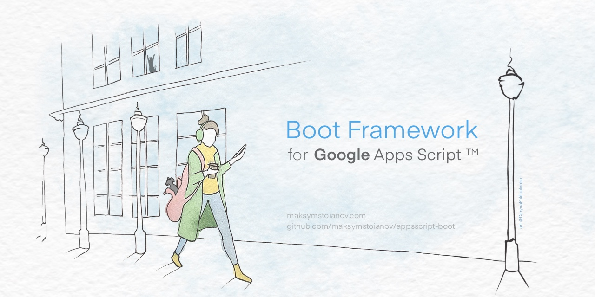

<a name="top"></a>



<p align="right">
    <small>
      <i>Artist: <a href="https://darynamikhailenko.com/?utm_source=github&utm_medium=readme&utm_campaign=apps-script-boot&utm_content=banner-artist-credit" title="Portfolio of Daryna Mikhailenko, the artist">Daryna Mikhailenko</a></i>
    </small>
</p>

# Boot Framework for Google Apps Script™

<p align="left">
  <a href="https://github.com/google/clasp"></a>
  <a href="LICENSE"></a>
  <a href="SECURITY.md"></a>
  <a href="ROADMAP.md"></a>
  <a href="https://github.com/bootgs/boot/releases"></a>
</p>

<p align="left">
  <a href="https://github.com/bootgs/boot/stargazers"></a>
  <a href="https://github.com/bootgs/boot/forks"></a>
  <a href="https://github.com/sponsors/MaksymStoianov"></a>
</p>

## Introduction

**Boot.gs** is a lightweight framework designed to help build structured Google Apps Script applications. It aims to
bring familiar development patterns, such as decorators and dependency injection, to the Apps Script environment to
aid in code organization.

## Installation

Install the framework via npm:

```bash
npm install github:bootgs/boot#main
```

> [!TIP]
> Use specific tags (e.g., `#v1.1.0`) in production for stability.

For example:

```bash
npm install github:bootgs/boot#v1.1.0
```

## Quick Start

### 1. Define a Controller

Create a class to handle your application's logic. Decorators make it easy to map methods to specific endpoints or
events.

```TypeScript
import {Get, RestController} from "boot";

@RestController("api/sheet")
export class SheetController {
    /**
     * Handles GET requests to /api/sheet/active-range
     */
    @Get("active-range")
    getActiveRange(): string {
        return "This action returns the active sheet range.";
    }
}
```

### 2. Initialize the Application

Bootstrap your application by creating an `App` instance and delegating the standard Apps Script entry points (`doGet`,
`doPost`) to it.

```TypeScript
import {App} from "boot";
import {SheetController} from "./SheetController";

/**
 * Global entry point for GET requests.
 */
export function doGet(event: GoogleAppsScript.Events.DoGet) {
    const app = App.create({
        controllers: [SheetController]
    });
    return app.doGet(event);
}

/**
 * Global entry point for POST requests.
 */
export function doPost(event: GoogleAppsScript.Events.DoPost) {
    const app = App.create({
        controllers: [SheetController]
    });
    return app.doPost(event);
}
```

## Features

- **Decorator-based Routing**: Intuitive mapping of HTTP and Apps Script events.
- **Dependency Injection**: Decouple your components for better testability.
- **Type Safety**: Built with TypeScript for a robust development experience.
- **Modern Architecture**: Inspired by frameworks like NestJS and Spring Boot.

## Decorators

### Class decorators

<details open><summary>Class decorators</summary>

<table width="100%">
  <thead>
    <tr>
      <th align="left">Decorator</th>
      <th align="left">Returns</th>
      <th align="left">Description</th>
    </tr>
  </thead>
  <tbody>
    <tr>
      <td><code>@Controller(type?: string, options?: object)</code></td>
      <td><code>ClassDecorator</code></td>
      <td>Marks a class as a general-purpose controller.</td>
    </tr>
    <tr>
      <td><code>@HttpController(basePath?: string)</code></td>
      <td><code>ClassDecorator</code></td>
      <td>Marks a class as an HTTP request controller. Default base path is <code>/</code>.</td>
    </tr>
    <tr>
      <td><code>@SheetController(sheetName?: string | string[] | RegExp)</code></td>
      <td><code>ClassDecorator</code></td>
      <td>Marks a class as a Google Sheets event controller. Can be filtered by sheet name (string, array, or RegExp).</td>
    </tr>
    <tr>
      <td><code>@DocController()</code></td>
      <td><code>ClassDecorator</code></td>
      <td>Marks a class as a Google Docs event controller.</td>
    </tr>
    <tr>
      <td><code>@SlideController()</code></td>
      <td><code>ClassDecorator</code></td>
      <td>Marks a class as a Google Slides event controller.</td>
    </tr>
    <tr>
      <td><code>@FormController()</code></td>
      <td><code>ClassDecorator</code></td>
      <td>Marks a class as a Google Forms event controller.</td>
    </tr>
    <tr>
      <td><code>@Service()</code></td>
      <td><code>ClassDecorator</code></td>
      <td>Marks a class as a service, typically holding business logic.</td>
    </tr>
    <tr>
      <td><code>@Repository()</code></td>
      <td><code>ClassDecorator</code></td>
      <td>Marks a class as a repository, abstracting data access logic.</td>
    </tr>
    <tr>
      <td><code>@Injectable()</code></td>
      <td><code>ClassDecorator</code></td>
      <td>Marks a class as available for dependency injection.</td>
    </tr>
    <tr>
      <td colspan="3" align="center"><b>Aliases</b></td>
    </tr>
    <tr>
      <td><code>@RestController(basePath?: string)</code></td>
      <td><code>ClassDecorator</code></td>
      <td>Alias for <code>@HttpController()</code>.</td>
    </tr>
    <tr>
      <td><code>@SheetsController(sheetName?: string | string[] | RegExp)</code></td>
      <td><code>ClassDecorator</code></td>
      <td>Alias for <code>@SheetController()</code>.</td>
    </tr>
    <tr>
      <td><code>@DocsController()</code></td>
      <td><code>ClassDecorator</code></td>
      <td>Alias for <code>@DocController()</code>.</td>
    </tr>
    <tr>
      <td><code>@SlidesController()</code></td>
      <td><code>ClassDecorator</code></td>
      <td>Alias for <code>@SlideController()</code>.</td>
    </tr>
    <tr>
      <td><code>@FormsController()</code></td>
      <td><code>ClassDecorator</code></td>
      <td>Alias for <code>@FormController()</code>.</td>
    </tr>
  </tbody>
</table>

</details>

### Method decorators

<details open><summary>Method decorators</summary>

<table width="100%">
  <thead>
    <tr>
      <th align="left">Decorator</th>
      <th align="left">Returns</th>
      <th align="left">Description</th>
    </tr>
  </thead>
  <tbody>
    <tr>
      <td><code>@Install()</code></td>
      <td><code>MethodDecorator</code></td>
      <td>Handles <a href="https://developers.google.com/apps-script/guides/triggers#oninstalle"><code>onInstall</code></a> event.</td>
    </tr>
    <tr>
      <td><code>@Open()</code></td>
      <td><code>MethodDecorator</code></td>
      <td>Handles <a href="https://developers.google.com/apps-script/guides/triggers#onopene"><code>onOpen</code></a> event.</td>
    </tr>
    <tr>
      <td><code>@Edit(...range?: (string | RegExp | string[])[])</code></td>
      <td><code>MethodDecorator</code></td>
      <td>Handles <a href="https://developers.google.com/apps-script/guides/triggers#onedite"><code>onEdit</code></a> event. Filter by A1-notation, sheet name, or RegExp.</td>
    </tr>
    <tr>
      <td><code>@Change(changeType?: SheetsOnChangeChangeType | SheetsOnChangeChangeType[])</code></td>
      <td><code>MethodDecorator</code></td>
      <td>Handles <code>onChange</code> event. Filter by <code>SheetsOnChangeChangeType</code>.</td>
    </tr>
    <tr>
      <td><code>@SelectionChange()</code></td>
      <td><code>MethodDecorator</code></td>
      <td>Handles <a href="https://developers.google.com/apps-script/guides/triggers#onselectionchangee"><code>onSelectionChange</code></a> event.</td>
    </tr>
    <tr>
      <td><code>@FormSubmit(...formId?: (string | string[])[])</code></td>
      <td><code>MethodDecorator</code></td>
      <td>Handles <code>onFormSubmit</code> event. Filter by one or more form IDs.</td>
    </tr>
    <tr>
      <td colspan="3" align="center"><b>HTTP Methods</b></td>
    </tr>
    <tr>
      <td><code>@Get(path?: string)</code></td>
      <td><code>MethodDecorator</code></td>
      <td>Maps a method to handle HTTP GET requests. Default path is <code>/</code>.</td>
    </tr>
    <tr>
      <td><code>@Post(path?: string)</code></td>
      <td><code>MethodDecorator</code></td>
      <td>Maps a method to handle HTTP POST requests.</td>
    </tr>
    <tr>
      <td><code>@Put(path?: string)</code></td>
      <td><code>MethodDecorator</code></td>
      <td>Maps a method to handle HTTP PUT requests.</td>
    </tr>
    <tr>
      <td><code>@Patch(path?: string)</code></td>
      <td><code>MethodDecorator</code></td>
      <td>Maps a method to handle HTTP PATCH requests.</td>
    </tr>
    <tr>
      <td><code>@Delete(path?: string)</code></td>
      <td><code>MethodDecorator</code></td>
      <td>Maps a method to handle HTTP DELETE requests.</td>
    </tr>
    <tr>
      <td><code>@Head(path?: string)</code></td>
      <td><code>MethodDecorator</code></td>
      <td>Maps a method to handle HTTP HEAD requests.</td>
    </tr>
    <tr>
      <td><code>@Options(path?: string)</code></td>
      <td><code>MethodDecorator</code></td>
      <td>Maps a method to handle HTTP OPTIONS requests.</td>
    </tr>
    <tr>
      <td colspan="3" align="center"><b>Aliases</b></td>
    </tr>
    <tr>
      <td><code>@GetMapping(path?: string)</code></td>
      <td><code>MethodDecorator</code></td>
      <td>Alias for <code>@Get()</code>.</td>
    </tr>
    <tr>
      <td><code>@PostMapping(path?: string)</code></td>
      <td><code>MethodDecorator</code></td>
      <td>Alias for <code>@Post()</code>.</td>
    </tr>
    <tr>
      <td><code>@PutMapping(path?: string)</code></td>
      <td><code>MethodDecorator</code></td>
      <td>Alias for <code>@Put()</code>.</td>
    </tr>
    <tr>
      <td><code>@PatchMapping(path?: string)</code></td>
      <td><code>MethodDecorator</code></td>
      <td>Alias for <code>@Patch()</code>.</td>
    </tr>
    <tr>
      <td><code>@DeleteMapping(path?: string)</code></td>
      <td><code>MethodDecorator</code></td>
      <td>Alias for <code>@Delete()</code>.</td>
    </tr>
    <tr>
      <td><code>@HeadMapping(path?: string)</code></td>
      <td><code>MethodDecorator</code></td>
      <td>Alias for <code>@Head()</code>.</td>
    </tr>
    <tr>
      <td><code>@OptionsMapping(path?: string)</code></td>
      <td><code>MethodDecorator</code></td>
      <td>Alias for <code>@Options()</code>.</td>
    </tr>
  </tbody>
</table>

</details>

### Parameter decorators

<details open><summary>Parameter decorators</summary>

<table width="100%">
  <thead>
    <tr>
      <th align="left">Decorator</th>
      <th align="left">Returns</th>
      <th align="left">Description</th>
    </tr>
  </thead>
  <tbody>
    <tr>
      <td><code>@Event()</code></td>
      <td><code>ParameterDecorator</code></td>
      <td>Injects the full Google Apps Script event object.</td>
    </tr>
    <tr>
      <td><code>@Request(key?: string)</code></td>
      <td><code>ParameterDecorator</code></td>
      <td>Injects the full request object or a specific property.</td>
    </tr>
    <tr>
      <td><code>@Headers(key?: string)</code></td>
      <td><code>ParameterDecorator</code></td>
      <td>Injects request headers or a specific header value.</td>
    </tr>
    <tr>
      <td><code>@Body(key?: string)</code></td>
      <td><code>ParameterDecorator</code></td>
      <td>Injects the full request body or a specific key.</td>
    </tr>
    <tr>
      <td><code>@Param(key?: string)</code></td>
      <td><code>ParameterDecorator</code></td>
      <td>Injects values from URL path parameters.</td>
    </tr>
    <tr>
      <td><code>@Query(key?: string)</code></td>
      <td><code>ParameterDecorator</code></td>
      <td>Injects values from URL query parameters.</td>
    </tr>
    <tr>
      <td><code>@Inject(token: any)</code></td>
      <td><code>ParameterDecorator</code></td>
      <td>Explicitly specifies an injection token for a dependency.</td>
    </tr>
    <tr>
      <td colspan="3" align="center"><b>Aliases</b></td>
    </tr>
    <tr>
      <td><code>@RequestBody(key?: string)</code></td>
      <td><code>ParameterDecorator</code></td>
      <td>Alias for <code>@Body()</code>.</td>
    </tr>
    <tr>
      <td><code>@PathVariable(key?: string)</code></td>
      <td><code>ParameterDecorator</code></td>
      <td>Alias for <code>@Param()</code>.</td>
    </tr>
    <tr>
      <td><code>@RequestParam(key?: string)</code></td>
      <td><code>ParameterDecorator</code></td>
      <td>Alias for <code>@Query()</code>.</td>
    </tr>
  </tbody>
</table>

</details>

## Contributing

We welcome contributions! Please see our [Contributing Guidelines](CONTRIBUTING.md) for details on our code of conduct,
and the process for submitting pull requests.

## Roadmap

Check out our [Roadmap](ROADMAP.md) to see what we have planned for future releases.

## Changelog

For a detailed list of changes and updates, please refer to the [CHANGELOG](CHANGELOG.md).

## License

This project is licensed under the [Apache-2.0 License](LICENSE).

---

<p align="center">
  ⭐ <b>Like this project?</b> Give it a star on <a href="https://github.com/bootgs/boot">GitHub</a>!
</p>
